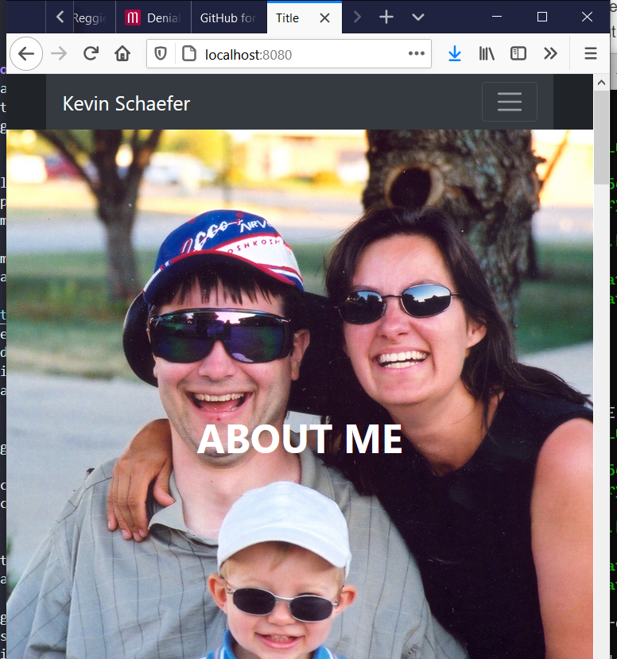

## 2.0 Web Server with Docker
Great! So you have now looked at `docker run`, played with some Docker containers and also got the hang of some terminology. Armed with all this knowledge, you are now ready to get to the real stuff &#8212; deploying web applications with Docker.

Docker images are the basis of containers. In the previous example, you **pulled** the *NGINX* official base image from the registry and asked the Docker client to run a container **based** on that image.

### 2.1 Run a static website in a container

We have used Docker to run a web server in a container. The website is based on an existing image.
```bash
$ docker run -it --rm -d -p 8080:80 --name web nginx
```
Now that the server is running, do you see the website? What port is it running on? And more importantly, how do you access the container directly from our host machine?

For more practice, let's stop the container that you have just launched. In order to do this, we need the container ID or name.

Since we ran the container in ****detached mode**, we don't have to launch another terminal to do this. Run `docker ps` to view the running containers.

```bash
docker ps
CONTAINER ID   IMAGE     COMMAND                  CREATED          STATUS          PORTS                  NAMES
98b8a32464fa   nginx     "/docker-entrypoint.…"   13 seconds ago   Up 11 seconds   0.0.0.0:8080->80/tcp   web
```

Check out the `CONTAINER ID` column. You will need to use this `CONTAINER ID` value, a long sequence of characters, to identify the container you want to stop, and then to remove it. The example below provides the `CONTAINER ID` on our system; you should use the value that you see in your terminal.
```bash
$ docker stop web
```
or
```bash
$ docker stop 98b8a32464fa
$ docker rm   98b8a32464fa
```
or
```bash
$ docker rm -f web
```
>**Note:** A cool feature is that you do not need to specify the entire `CONTAINER ID`. You can just specify a few starting characters and if it is unique among all the containers that you have launched, the Docker client will intelligently pick it up.

Now that you've seen how to run a webserver inside a Docker container, how do you serve your pages from a Docker image? This is the question we'll explore in the next section.

Run `docker ps -a` to make sure the containers are gone.

```bash
$ docker ps -a
CONTAINER ID        IMAGE               COMMAND             CREATED             STATUS              PORTS               NAMES
```

### Getting your content into the web server

##### Adding Custom HTML
By default, Nginx looks in the /usr/share/nginx/html directory inside of the container for index.html file(s) to serve. We need to get our html files into this directory. A fairly simple way to do this is use a **mounted volume**. With mounted volumes, we are able to link a directory on our local machine and map that directory into our running container.

Let’s create a custom html page and then serve that using the nginx image.

From your Linux home directory, create a directory named site-content. In this directory add an index.html file and add the following html to it:
```
<!doctype html>
<html lang="en">
  <head>
    <title>Show In Container</title>
    <meta charset="utf-8">
  </head>
  <body><h3>Being served by NGINX</h3></body>
</html>
```
Now run the following command, which is the same command as above, but now we’ve added the -v flag to create a bind mount volume. This will mount our local directory ~/site-content locally into the running container at: /usr/share/nginx/html
```
$ docker run -it --rm -d -p 8080:80 --name web -v ~/site-content:/usr/share/nginx/html nginx
```
Open your favorite browser and navigate to http://localhost:8080 and you should see the above html rendered in your browser window. A better command to issue is to use "$PWD" in plce of your local path. This tells docker to map your current working directory to the nginx web document directory in the container.
```
$ docker run -it --rm -d -p 8080:80 --name web -v "$PWD":/usr/share/nginx/html nginx
``` 
Finally, to finish this part of the exercise we will create the folder that will contain your personal webpages that you created for the previous assignment. Then we will test NGINX container running and hosting your files.

First we need you to return to your home directory (cd ~). From there you of an create the folder name that you will keep and use to build your custom Docker image and your Git repository that will be submitted for this assignment. Create your folder/directory and name it _nginx-hosting_.

Copy your personal Bootstrap webpages and supporting files into the folder with the appropriate file and folder structure. Your index file must be at the root level of your new nginx-hosting folder. You do not want it inside of a subdirectory. Next test the web server by running a __docker run__ like the last one we ran to prove that it is is serving your pages.
```
kevin@Elitebook-14:~$ cd nginx-hosting/
kevin@Elitebook-14:~/nginx-hosting$ ls -l
drwxr-xr-x  2 kevin kevin  4096 Jan 28 17:48 css/
-rwxr-xr-x  1 kevin kevin  3049 Jan 28 17:48 demo354.html*
-rwxr-xr-x  1 kevin kevin  6154 Jan 28 17:48 gallery.html*
drwxr-xr-x  3 kevin kevin  4096 Jan 28 17:48 img/
-rwxr-xr-x  1 kevin kevin  6734 Jan 28 18:01 index.html*
drwxr-xr-x  2 kevin kevin  4096 Jan 28 17:48 js/

kevin@Elitebook-14:~/nginx-hosting$ docker run -it --rm -d -p 8080:80 --name web -v "$PWD":/usr/share/nginx/html nginx
f6f5419394c51373dac564ae7e541d7529711623977bcc498e164d179f4a260d
```


All good! Stop and remove some earlier containers and images to clean up. Get ready for the next section in which we build a docker image. 

### 2.2 Building a Docker Image

##### Build Custom NGINX Image
Bind mounts are a great option for running locally and sharing files into a running container. But what if we want to move this image around and have our html files moved with it?

In our previous section I asked you to create a folder, nginx-hosting, which we will use to build your image. In that folder, you should have already copied your necessary files to serve your webpages created in the previous assignment. 

There are a couple of options available but one of the most portable and simplest ways to do this is to copy our html files into the image by building a custom image.

A [Dockerfile](https://docs.docker.com/engine/reference/builder/) is a text file that contains a list of commands that the Docker daemon calls while creating an image. The Dockerfile contains all the information that Docker needs to know to run the app &#8212; a base Docker image to run from, location of your project code, any dependencies it has, and what commands to run at start-up. It is a simple way to automate the image creation process.

To build a custom image, we’ll need to create a Dockerfile and add our commands to it.

In the same directory, create a file named Dockerfile and paste the below commands.

```
FROM nginx:latest
COPY ./* /usr/share/nginx/html/
```
We start building our custom image by using a base image. On line 1, you can see we do this using the FROM command. This will pull the nginx:latest image to our local machine and then build our custom image on top of it.

In the next statement, we COPY all files in the same folder as the Dockerfile into the /usr/share/nginx/html directory inside the container overwriting the default index.html file provided by nginx:latest image.

You’ll notice that we did not add an ENTRYPOINT or a CMD to our Dockerfile. We will use the underlying ENTRYPOINT and CMD provided by the base NGINX image.

To build our image, run the following command:
```
$ docker build -t webserver .
```
The build command will tell Docker to execute the commands located in our Dockerfile. You will see a similar output in your terminal as below:


Check to see that you have a new image with __docker images__.

Now we can run our image in a container but this time we do not have to create a bind mount with -v to include our html.

$ docker run -it --rm -d -p 8080:80 --name web webserver

Open your browser and navigate to http://localhost:8080 to make sure your html pages are being served correctly.

In this article we walked through running the NGINX official image, adding our custom html files, building a custom image based off of the official image and configuring the NGINX as a reverse proxy. We finished up by pushing our custom image to Docker so we could share with others on our team.

>**Note:** If you want to learn more about Dockerfiles, check out [Best practices for writing Dockerfiles](https://docs.docker.com/engine/userguide/eng-image/dockerfile_best-practices/).

## Next Step
For the final steps in the tutorial head over to [3.0 Git Push to Repo](./repo-push.md)
